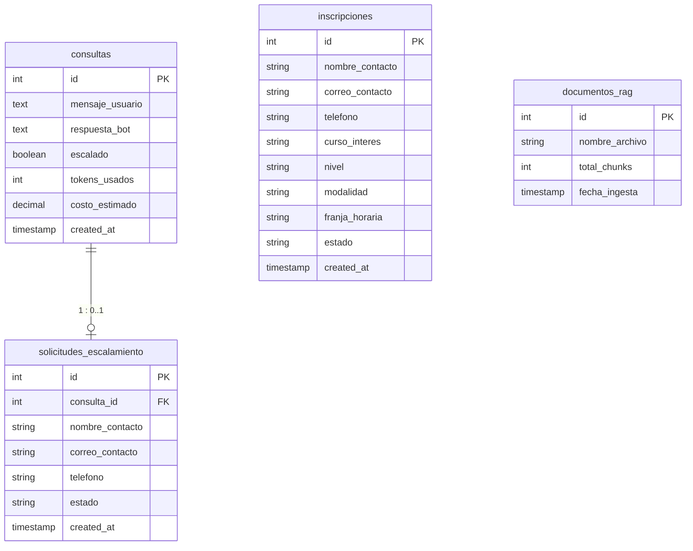

# 🌍 Horizon Academy - Intelligent RAG Customer Service Assistant

An advanced AI-powered Customer Service Assistant designed for **Horizon Academy**, built using a **RAG (Retrieval-Augmented Generation)** architecture powered by **Groq API (`llama-3.3-70b-versatile`)**, a **0-Token Static Interception Engine**, **Custom Calculation Skills (MCP Standard)**, and a **Relational Database (SQLite + SQLAlchemy)** for audit logging, escalations, and student enrollment tracking.

---

## 🛠️ Key Architectural Components

### 1. **Groq API (`llama-3.3-70b-versatile`) & Fallbacks**
- Primary LLM: **Groq API** utilizing the ultrafast `llama-3.3-70b-versatile` model (~200ms latency, high precision in Spanish).
- Fallback Sequence: **Groq API** ➔ **OpenAI (`gpt-4o-mini`)** ➔ **Google Gemini** ➔ **Local Ollama (`llama3`)**.

### 2. **Relational Database (`backend/horizon_academy.db` via SQLAlchemy)**
- Fully functional embedded relational database implementing 4 core tables:
  1. **`consultas`**: Interaction logs capturing user query, bot reply, escalation flag, tokens used, estimated USD cost, and timestamps.
  2. **`solicitudes_escalamiento`**: Human escalation tickets linked 1:1 or 1:N to original user queries.
  3. **`documentos_rag`**: Tracks knowledge base document ingestion (`.txt`), chunk counts, and sync timestamps with ChromaDB.
  4. **`inscripciones`**: Stores all student registrations submitted via the website's enrollment form.

### 3. **0-Token Static Response Engine (`backend/static_responses.py`)**
- Intercepts common user queries (greetings, schedule issues, human advisor requests, payment methods, placement tests, certificates, locations).
- **Anti-Gibberish Detector**: Prevents LLM token consumption on invalid keyboard mashing or random strings.

### 4. **Custom Calculation Skills / MCP Standard (`backend/mcp_tools.py`)**
- Business rules calculation tools:
  - **`calculate_tuition_fee`**: Computes module costs ($480k COP), registration fees ($60k COP), 10% Trimodular package discounts, and 5% Early Bird discounts.
  * **`calculate_placement_test_recommendation`**: Evaluates test scores (0-100 pts) and recommends MCER level (A1-C1).
  * **`calculate_total_course_hours`**: Computes live guided hours (40h/module) and platform hours (20h/module).
  * **`calculate_installment_plan`**: Computes bimestral payment plans.

### 5. **ChromaDB Vector Database & HuggingFace Embeddings**
- Text documents in `backend/data/` are embedded locally using `all-MiniLM-L6-v2` and stored in ChromaDB (`chroma_db/`). Top 10 context chunks are retrieved per query.

### 6. **Student Enrollment UI Tab & Modal**
- Interactive navigation tab and popup modal on the main website allowing prospective students to select courses (English, French, German, Italian), desired MCER level, modality, and schedule, saving registrations directly into SQLite.

---

## 🗄️ Database Schema & Entity-Relationship Diagram



---

## 📁 Repository Structure

```text
prcIA-master/
├── backend/
│   ├── data/                 # Business documentation (.txt files)
│   ├── database.py           # SQLAlchemy DB models, engine & CRUD loggers
│   ├── main.py               # FastAPI server REST endpoints
│   ├── rag.py                # LangChain + ChromaDB + Groq RAG Engine
│   ├── static_responses.py   # 0-Token Interception & Gibberish detector
│   ├── mcp_tools.py          # Custom calculation skills & MCP tools
│   ├── services.py           # In-memory Cache & Live Metrics Service
│   ├── horizon_academy.db    # SQLite persistent database (created automatically)
│   └── requirements.txt      # Python dependencies
├── frontend/
│   ├── index.html            # Landing Page + Inscription Modal + Chat SPA
│   ├── style.css             # White & Corporate Blue Theme + CSS Animations
│   ├── main.js               # SPA logic, modal handlers, API REST calls
│   └── vite.config.js        # Frontend Vite configuration
├── chroma_db/                # Local Vector Database directory (persisted)
├── .env                      # Environment variables & API keys
├── .env.example              # Environment variables template
├── package.json              # Frontend npm dependencies & scripts
├── vite.config.js            # Root proxy configuration
└── README.md                 # Technical documentation
```

---

## 🔌 REST API Reference

| Endpoint | Method | Description |
| :--- | :--- | :--- |
| `/api/chat` | `POST` | Processes user questions via 0-token engine, cache, or RAG LLM (Groq). |
| `/api/inscriptions` | `POST` | Registers a new student enrollment into the `inscripciones` DB table. |
| `/api/inscriptions` | `GET` | Retrieves all registered student enrollments. |
| `/api/escalate` | `POST` | Creates a human support ticket in `solicitudes_escalamiento`. |
| `/api/metrics` | `GET` | Returns live telemetry (processed queries, cache hits, escalation %, estimated cost). |
| `/api/config` | `GET` | Returns public configuration URLs. |

---

## 🚀 Setup & Execution Guide

### 1. Backend Setup

1. Create and activate a virtual environment:
   ```bash
   python -m venv venv
   # Linux / macOS
   source venv/bin/activate
   # Windows
   venv\Scripts\activate
   ```

2. Install Python dependencies:
   ```bash
   pip install -r backend/requirements.txt
   ```

3. Configure Environment Variables (`.env`):
   ```bash
   cp .env.example .env
   ```
   Add your **Groq API Key**:
   ```env
   GROQ_API_KEY=gsk_your_groq_api_key_here
   OLLAMA_BASE_URL=http://localhost:11434
   OLLAMA_MODEL=llama3
   ESCALATION_FORM_URL=https://docs.google.com/forms/d/e/1FAIpQLSdAyhhqdotfhe9bwKaCC0faNaArmJLSjQOmuD9feRl0pEd95A/viewform
   ```

---

### 2. Frontend Setup

In a second terminal, install dependencies:
```bash
npm install
```

---

### 3. Running the Application

#### **Terminal 1: Backend Server (FastAPI)**
```bash
# Windows
venv\Scripts\activate
uvicorn backend.main:app --host 0.0.0.0 --port 3000 --reload
```
*Backend API runs at `http://localhost:3000`.*

#### **Terminal 2: Frontend App (Vite)**
```bash
npm run dev
```
*Frontend runs at `http://localhost:5173`.*
